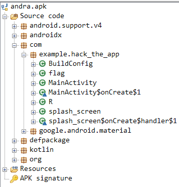
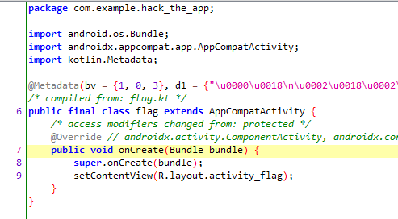
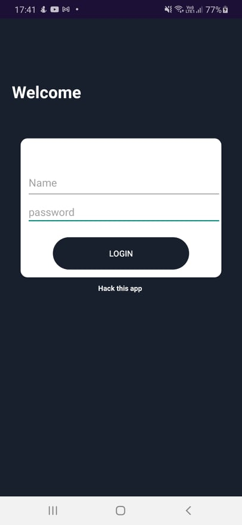

# Andra

## The brief

```
You know what to do. :)
```

## apktool

I downloaded `apktool` and ran it against the `andra.apk` file. Next I navigated through the files to `smali/com/example/hack_the_app/`. Here we have some `smoli` files, they are not great to read, but I tried. Two really stood out to me, `MainActivity.smoli` and `flag.smoli`. Flag had nothing I could understand, but MainActivity:
```
    const-string v0, "login_btn"

    .line 30
    invoke-static {v0}, Lkotlin/jvm/internal/Intrinsics;->throwUninitializedPropertyAccessException(Ljava/lang/String;)V

    :cond_0
    new-instance v0, Lcom/example/hack_the_app/MainActivity$onCreate$1;

    const-string v1, "Nahamcom"

    const-string v2, "pink_panther@786"

    invoke-direct {v0, p0, v1, v2}, Lcom/example/hack_the_app/MainActivity$onCreate$1;-><init>(Lcom/example/hack_the_app/MainActivity;Ljava/lang/String;Ljava/lang/String;)V

    check-cast v0, Landroid/view/View$OnClickListener;

    invoke-virtual {p1, v0}, Landroid/widget/Button;->setOnClickListener(Landroid/view/View$OnClickListener;)V

    return-void
```
Clearly visible login creds! `jadx` next up

## jadx

Again I downloaded the tool `jadx` and gave it `andra.apk`:
</br>



</br>

Looking at the `flag` class I concluded that I'll have to install the app on my phone and run it:
</br>



</br>
So I allowed 3rd party installs on my phone and did just that.

## Getting the flag

After the install I just ran the app:
</br>



</br>

And we have the credentials! `Nahamcom:pink_panther@786`

</br>


</br>

Voila