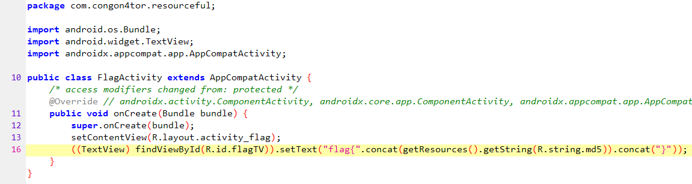
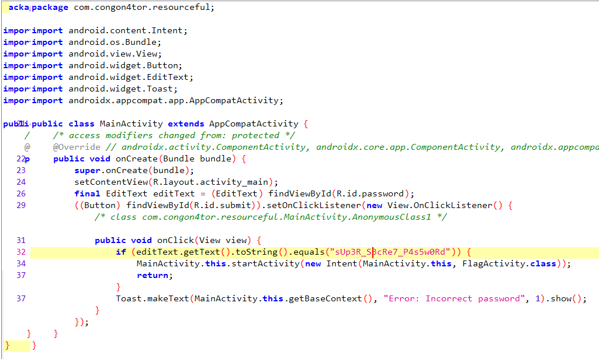
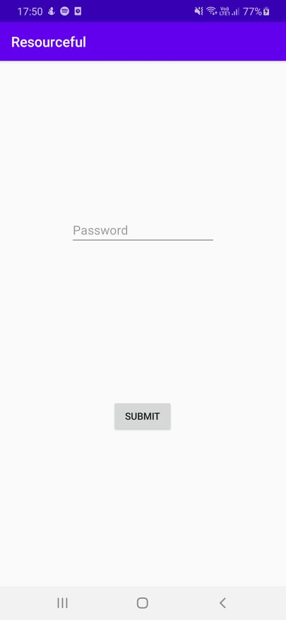

# Resourceful

## The brief

```
I built my first ever android app with authentication!
```

## jadx

This time I jumped straight to `jadx` and it proved fruitful! First look at the `FlagActivity` class 

</br>



</br>

Right, so the flag is put together at runtime. What about in the `MainActivity` class:
</br>



</br>

Wow, that was easy. Just a hardocded password. Time to loaded it and install it, then run it!

</br>



</br>

We just input the hardcoded password and the flag appears!

</br>


</br>