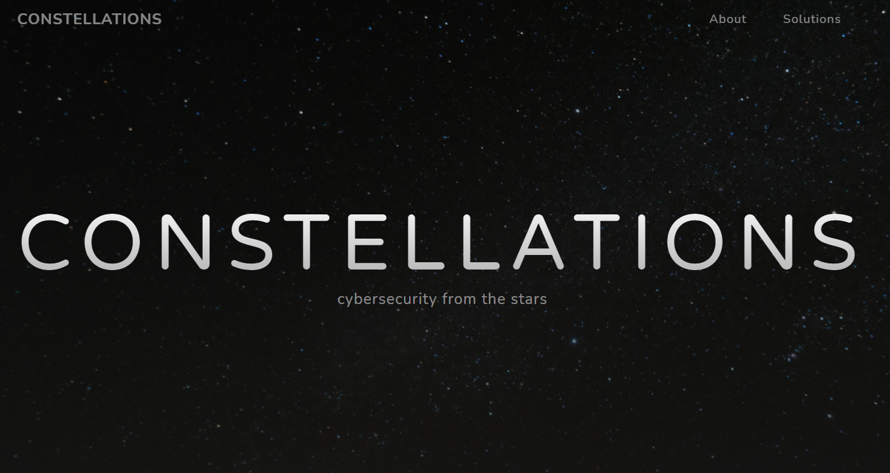

# Bionic

## The briefing

```
Thank you for taking on The Mission. You can begin by exploring the CONSTELLATIONS public website, constellations.page.

CONSTELLATIONS has "tried" to reduce their attack surface by offering just a static website. But you might find some low-hanging fruit to get you started.

You should find the flag for this challenge ON THIS constellations.page website.

With the flag of this challenge, you should also find a new URL that will assist in the next challenge.

After solving this challenge, you may need to refresh the page to see the newly unlocked challenges.
```

## The research

After navigating to [consteallations.page](https://constellations.page/) (might be a dead link). And we are greeted by this webpage:</br>


</br>
Very nice stars, what can we do here? Well run [webctf](https://github.com/xnomas/web-ctf-help):
```
webctf https://constellations.page

=============
COMMENTS
=============

[+] 1 :   Vela, can we please stop sharing our version control software out on the public internet?
[+] 2 :   Bootstrap core CSS
[+] 3 :   Custom fonts for this template
[+] 4 :   Custom styles for this template
[+] 5 :   Navigation
[+] 6 :   Header
[+] 7 :   About Section
[+] 8 :   Projects Section
[+] 9 :   Featured Project Row
[+] 11 :   Project Two Row
[+] 12 :   Contact Section
[+] 13 :   Footer
[+] 14 :   Bootstrap core JavaScript
[+] 15 :   Plugin JavaScript
[+] 16 :   Custom scripts for this template

=============
SCRIPTS
=============

[+] 1 : assets/vendor/jquery/jquery.min.js
[+] 2 : assets/vendor/bootstrap/js/bootstrap.bundle.min.js
[+] 3 : assets/vendor/jquery-easing/jquery.easing.min.js
[+] 4 : assets/js/grayscale.min.js

=============
IMAGES
=============

sources:
--------
[+] 1 : assets/img/laptop.png
[+] 2 : assets/img/training_medium.jpg
[+] 3 : assets/img/development_medium.jpg
[+] 4 : assets/img/media_medium.jpg

alts:
-----
[+] 1 :
[+] 2 :
[+] 3 :
[+] 4 :

===================
INTERESTING HEADERS
===================

Server : Apache/2.4.25 (Debian)
```
We know that their GitHub is available. Aaaalright, time to go there.... or is it? 

## R.U.R

Rossums Universal Robots - A book by Karel Čapek about the dangers of technology, and also where the word `robot` comes from. Why am I saying this?
```
User-agent: *
Disallow: /meet-the-team.html

flag{33b5240485dda77430d3de22996297a1}  # this flag is for `Bionic`
```
^ robots.txt