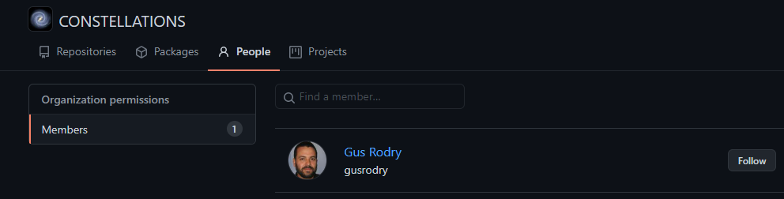
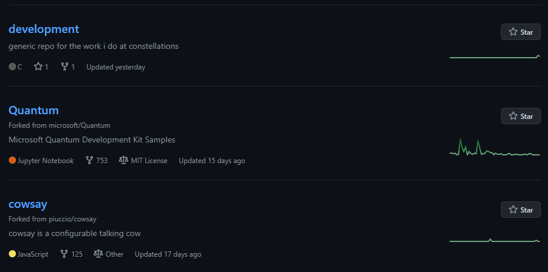
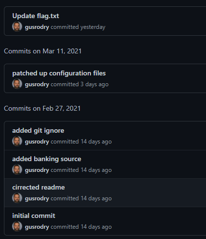

# Gus

## The brief

```
This is Stage 1 of Path 4 in The Mission. After solving this challenge, you may need to refresh the page to see the newly unlocked challenges.

Use open-source intelligence to track down information on Gus.

With the flag of this challenge, you should also find details you can use in later challenges.
```

## Finding gus

The first place you should have already looked at is the constellations github!
</br>

</br>
Brilliant, time to check out his repos.
</br>

</br>
Right, so `development` seems to be his own project and might be worth a look! Whenever doing a GitHub related OSINT challenge I check the commits:
</br>

</br>
We have lots, but `Update flag.txt` is the important one now.

## Flag

```
# NOTE:
# This flag submits for the `Gus` challenge you should see after solving `Meet The Team`, after you solve `Bionic`

flag{84d5cc7e162895fa0a5834f1efdd0b32}
```
The other files are important later :)