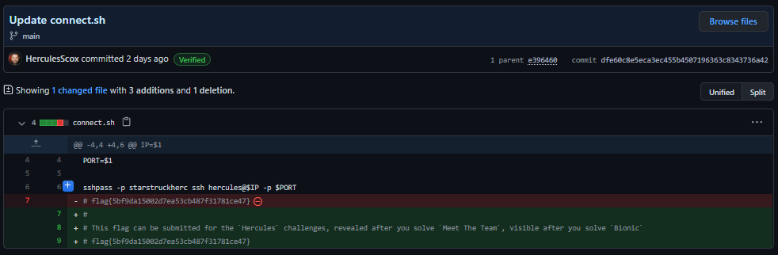

# Hercules

## The brief

```
This is Stage 1 of Path 2 in The Mission. After solving this challenge, you may need to refresh the page to see the newly unlocked challenges.

Use open-source intelligence to track down information on Hercules.

With the flag of this challenge, you should also find details you can use in later challenges.
```

## Finding Hercules

This challenge is really easy if you have already solved `Gus`. Why you ask? Well let look at Gus's followers:
</br>

</br>
There he is! Time to look through his repos and commits:
</br>

</br>
Again, one personal project. The latest commit has what we need:
</br>

</br>
Nice! And some creds for stage 2.