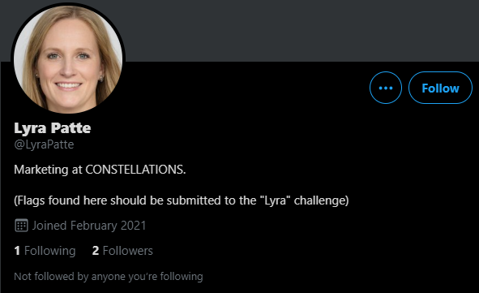
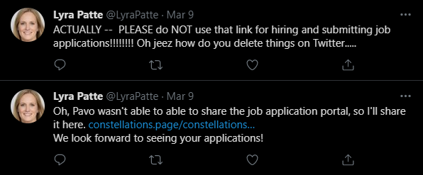
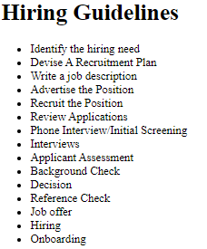
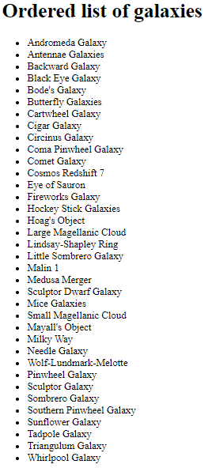

# Lyra 

## The brief

```
This is Stage 1 of Path 5 in The Mission. After solving this challenge, you may need to refresh the page to see the newly unlocked challenges.

Use open-source intelligence to track down information on Lyra.

With the flag of this challenge, you should also find details you can use in later challenges.
```

## Finding Lyra

How can we find her? Well using the previous list again:
</br>


</br>

So we are looking for a `Lyra Patte`. Orion was on twitter, maybe I can find her there as well?

</br>



</br>

Great! Now what does she have here? 

</br>



</br>

Is there maybe some sort of vulnerability or disclosure on their site? Time to check it out! `https://constellations.page/constellations-documents/1/`

</br>



</br>

At first glance this is an extremely boring document. All we have are `Hiring Guidelines`. But wait! Is that really all? Take a look at the URL: 
```
https://constellations.page/constellations-documents/1/

constellations-documents => Folder

/1/ => 1st file

```
Maybe there's more than one? This can be easily checked by swapping 1 for 2:
</br>



</br>

It works! Now just to find the page with a flag (fuzzing can be used, but this is easily done just manually. Check if there is a document 10. No? Try less, let's say 8, etc.):
```
https://constellations.page/constellations-documents/5/

CONSTELLATIONS Default Account Passwords
INTERNAL: this should not be shared outside of the org
Personnel Names

User accounts following the naming convention of lowercase firstname.

orion
pavo
gus
vela
hercules
leo
lyra
gemini

Default Passwords
flag{bd869e6193c27308d2fd3ad4b427e8c3}
starstar
allstars
starstruck
starshine
starsky
popstars
starship
....
```
Nice! We have the flag... but this looks oddly similliar to a wordlist... maybe we can use it later.