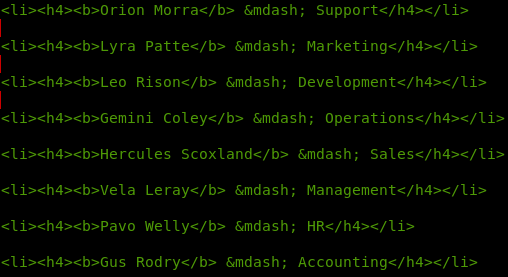
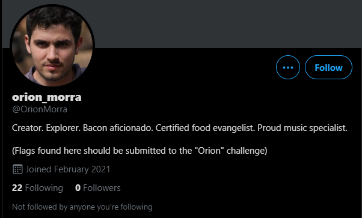
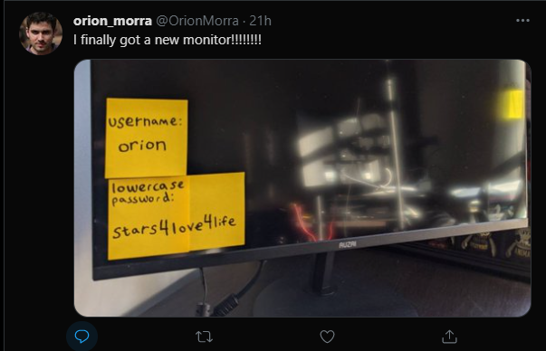
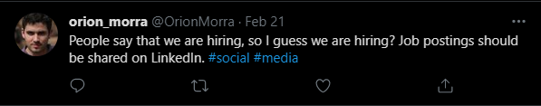
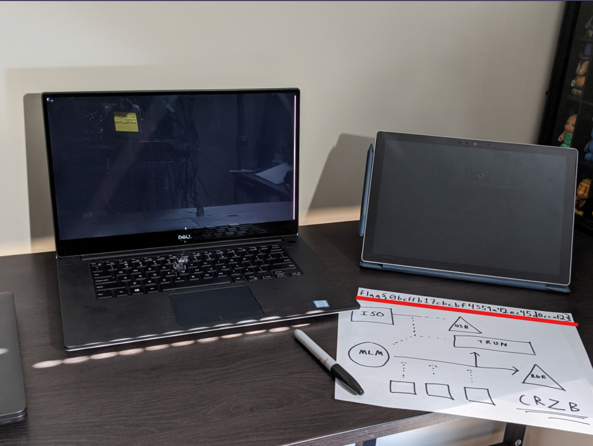

# Orion

## The brief

```
This is Stage 1 of Path 3 in The Mission. After solving this challenge, you may need to refresh the page to see the newly unlocked challenges.

Use open-source intelligence to track down information on Orion.

With the flag of this challenge, you should also find a password you can use in later challenges.
```

## Searching for Orion

My initial thoughts were to look through the followers of Gus and Hercules. But nah, they ain't there. Maybe followers of constellations on twitter? Also not. But remember `Meet the Team`! We recovered the whole list of employees:
</br>

</br>
Maybe search on twitter?

## Twitter

I searched Twitter for `Orion Morra`:
</br>

</br>
And this hunk of a man showed up (ha). What's the first tweet?
</br>

</br>
Nice, this is for the next phase. But is their some more information for us?

</br>



</br>

Great, this might be of use in other phases! And the flag?

</br>



</br>
Awesome! `flag{0bcffb17cbcbf4359a42ec45d0ccaf2}`