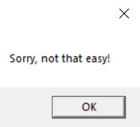
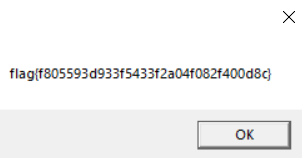

# Warmups

Here are all my solutions to the `warmups` category, except for `Eighth Circle`

## Veebee

I use Windows, so I just ran it:
</br>



</br>

Just click through the second, and here we go:

</br>



</br>
Nice!

## Chicken wings

We have this encoded flag:
```
♐●♋♑❀♏📁🖮🖲📂♍♏⌛🖰♐🖮📂🖰📂🖰🖰♍📁🗏🖮🖰♌📂♍📁♋🗏♌♎♍🖲♏❝
```
This is wingdings and we can decode this [here](https://lingojam.com/WingDing):
```
flag{e0791ce68f718188c0378b1c0a3bdc9e}
```

## Shoelaces

We have an image of shoelaces, I just ran `strings`, that's my instinct to check for a flag right away: 
```
strings shoelaces.jpg | grep flag

flag{137288e960a3ae9b148e8a7db16a69b0}
```

## Car keys

```
We found this note on someone's key chain! It reads... ygqa{6y980e0101e8qq361977eqe06508q3rt}? There was another key that was engraved with the word QWERTY, too...
```
So this is definitely a `QWERTY` shift, I used [this]():
```
foak{6f980c0101c8aa361977cac06508a3de}
```
Just fix the prefix
```
flag{6f980c0101c8aa361977cac06508a3de}
```

## Buzz

```
You know, that sound that bumblebees make?
```

They `zzzzzzzz`, just use `7z x` on the file:
```
7z x buzz

7-Zip [64] 16.02 : Copyright (c) 1999-2016 Igor Pavlov : 2016-05-21
p7zip Version 16.02 (locale=en_US.UTF-8,Utf16=on,HugeFiles=on,64 bits,3 CPUs Intel(R) Core(TM) i7-8550U CPU @ 1.80GHz (806EA),ASM,AES-NI)

Scanning the drive for archives:
1 file, 45 bytes (1 KiB)

Extracting archive: buzz
--
Path = buzz
Type = Z

Everything is Ok

Size:       39
Compressed: 45
```
And your flag is in the extracted files:
```bash
cat buzz~
flag{b3a33db7ba04c4c9052ea06d9ff17869}
```

## Pollex

We have an image:
```
👍

Download the file below.
```
I was too lazy to switch to my `Kali` VM and run `file` etc. So I just used this [exif tool](http://exif.regex.info/exif.cgi):
</br>


</br>

## esab64

Try reconstructing it. `esab64` is kind of like `base64` isn't it?
```
python3
Python 3.7.4 (default, Jul 11 2019, 10:43:21) 
[GCC 8.3.0] on linux
Type "help", "copyright", "credits" or "license" for more information.
>>> with open('esab64','rt') as file:
...      todebase = file.readlines()
... 
>>> todebase
['mxWYntnZiVjMxEjY0kDOhZWZ4cjYxIGZwQmY2ATMxEzNlFjNl13X']
>>> todebase[0][::-1]
'X31lNjFlNzExMTA2YmQwZGIxYjc4ZWZhODk0YjExMjViZntnYWxm'
>>> import base64
>>> base64.b64decode(todebase[0][::-1])
b'_}e61e711106bd0db1b78efa894b1125bf{galf'
>>> base64.b64decode(todebase[0][::-1])[::-1]
b'flag{fb5211b498afe87b1bd0db601117e16e}_'
```
There it is :)
