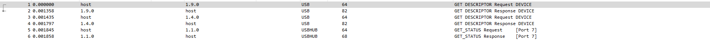

# Henpeck

## The brief

```
So I'll be honest, I never actually went through the Mavis Beacon program...
```

## Wireshark

We have a `.pcap` file, which always screams wireshark to me! So here we go:
</br>



</br>

This is a usb capture analysis.... I don't really have experience with those, so Google was my friend.

## Research

After googling `wireshark usb capture for ctf` I got [this link](https://abawazeeer.medium.com/kaizen-ctf-2018-reverse-engineer-usb-keystrok-from-pcap-file-2412351679f4). It's a really good read, and has everything you need to solve this. Use the following filter:
```
((usb.transfer_type == 0x01) && (frame.len == 72)) && !(usb.capdata == 00:00:00:00:00:00:00:00)
```
This shows just the `USB_INTERRUPT` calls, which means keystrokes! Next we save it to a csv, and cut out the hex to a file (this is in the article, I won't just rip it off).</br>

One thing you will need to do is format the python code correctly, like this:
```py
newmap = {
2: "PostFail",
4: "a",
5: "b",
6: "c",
7: "d",
8: "e",
9: "f",
10: "g",
11: "h",
12: "i",
13: "j",
14: "k",
15: "l",
16: "m",
17: "n",
18: "o",
19: "p",
20: "q",
21: "r",
22: "s",
23: "t",
24: "u",
25: "v",
26: "w",
27: "x",
28: "y",
29: "z",
30: "1",
31: "2",
32: "3",
33: "4",
34: "5",
35: "6",
36: "7",
37: "8",
38: "9",
39: "0",
40: "Enter",
41: "esc",
42: "del",
43: "tab",
44: "space",
45: "-",
47: "[",
48: "]",
56: "/",
57: "CapsLock",
79: "RightArrow",
80: "LetfArrow"
}

myKeys = open('hex.txt')
i = 1
for line in myKeys:
	bytesArray = bytearray.fromhex(line.strip())
	#print "Line Number: " + str(i)
	for byte in bytesArray:
		if byte != 0:
			keyVal = int(byte)
			if keyVal in newmap:
				print newmap[keyVal]
			else:
				print "No map found for this value " + str(keyVal)
	i+=1
```
Also if you copy the code, you will have to replace all the `”` with regular `"`. So what does it do? We have a dictionary mapping each hex value to a key. Then we read from the `hex.txt` file, where we have all our hex output from the `.pcap`. A byte array is created from each line and as long as it is not zero, it is turned into an `integer` and the mapping in the dict is printed out! Nice!</br>
```
flag{f7733e0093b7d281dd0a30fcf34a9634}
```
Here is the flag :)